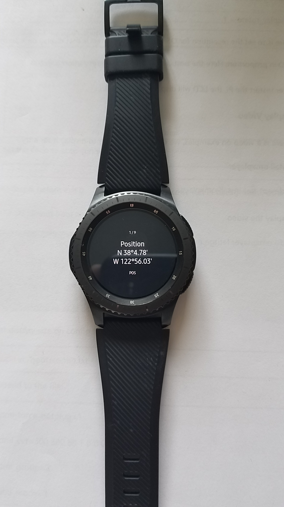
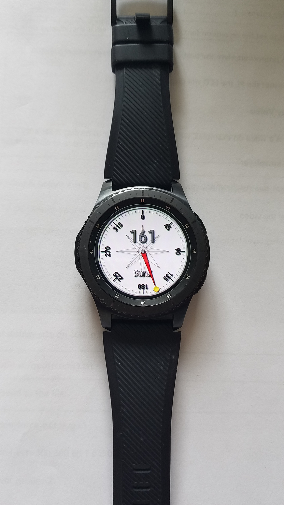
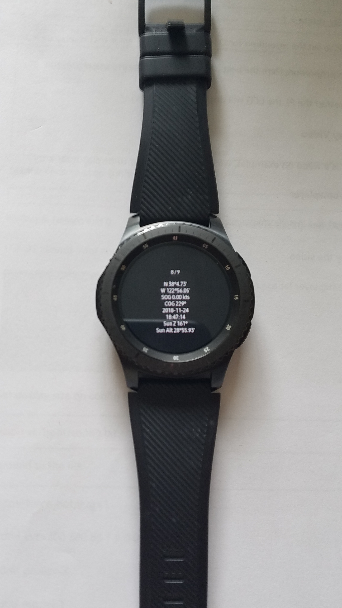

This directory will contain apps running on the Samsung Frontier watch.

Use the [Tizen IDE](https://www.tizen.org/) to  build them.

-----------------------------------------------------------

#### Lessons learned
- CSS grid are supported... so-so on the Frontier.

### REST Remote Switch
Drive a Relay connected to a Raspberry Pi.

| Apps | Switch |
|:----:|:------:|
|||

### Weather Station Client ☁️☀️⛅

| Apps | Client |
|:----:|:------:|
|||

### NMEA Client ⛵
#### <!-- WIP 🚧 --> REST Client for the [Nav Server](https://github.com/OlivierLD/raspberry-coffee/tree/master/RESTNavServer).

| Apps | BSP | AWS | SOG |
|:----:|:---:|:---:|:---:|
|||||

The rotary detent can be used to change screen, like the left and right arrows and swipes on the screen.

##### The real watch

| BSP  | AWS |
|:----:|:---:|
|||

### NMEA Client ⛵
#### <!-- WIP 🚧 --> REST Client for the [Nav Server](https://github.com/OlivierLD/raspberry-coffee/tree/master/RESTNavServer), V2.

To change screen, use the rotary detent, or swipe the screen with a finger.

| POS | SOG | COG | Sun Pos | Sun Z | Server IP |
|:----:|:---:|:---:|:---:|:---:|:---:|
|||||||

The rotary detent can be used to change screen, as well as left and right swipes on the screen.

`Sun Z` stands for "Sun's Azimuth". If you point the needle to the Sun, you know where the North is 😜.

This is a configuration I like for kayaking. There is a logger ([RESTNavServer](https://github.com/OlivierLD/raspberry-coffee/tree/master/RESTNavServer)) running on a `Raspberry Pi Zero W` in a waterproof box, and this is like a dashboard,
you can see what you're doing. [Here](http://hocus-blogus.blogspot.com/2018/11/thanksgiving-kayaking-in-drakes-estero.html) is an example of such a logging.

**The real watch with real data**

| POS | SOG | COG | GPS Time | Sun Pos | Sun Z | Track | Summary | Server IP |
|:----:|:---:|:---:|:---:|:---:|:---:|:---:|:---:|:---:|
||||||||||

---

### TODO
- GPS Location (Basics) 🛰️. Done &#9989;.
- Street Cleaning 🚗

---

## To install an app on your Frontier watch
- Install Tizen 3.0 and wearable extensions (including the certificate ones)
- Clone the project of your choice in Tizen
- Connect your watch to Tizen
- Generate a Samsung certificate and activate it (with the watch connected)
- Optionally, you might need to modify the hard-coded URLs.
- Re-build the app
- Deploy on the watch, and run.

---
