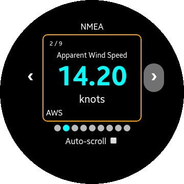

This directory will contain apps running on the Samsung Frontier watch.

Use the [Tizen IDE](https://www.tizen.org/) to  build them.

-----------------------------------------------------------

### NMEA Client
#### WIP 🚧 REST Client for the Nav Server.

| BSP | AWS | SOG |
|:---:|:---:|:---:|
||||

The rotary detent can be used to change screen, like the left and right arrows.

### TODO
- REST Requests
- GPS Location
- Local JavaScript, where to put it?
- Street Cleaning 🚗

